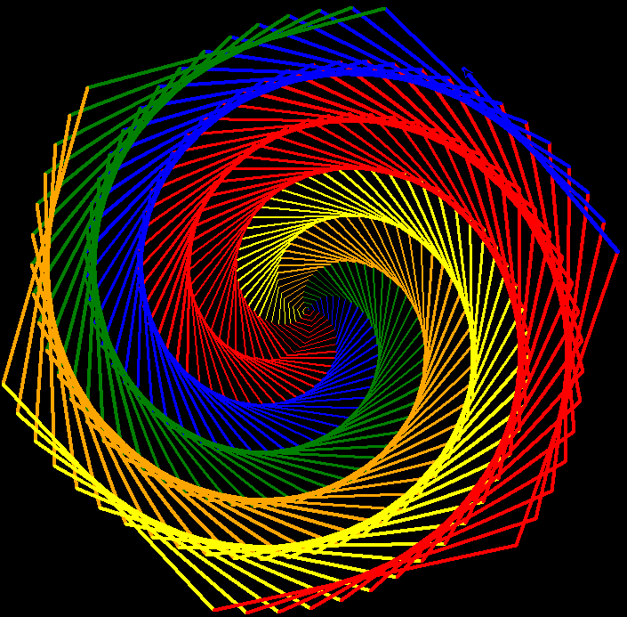
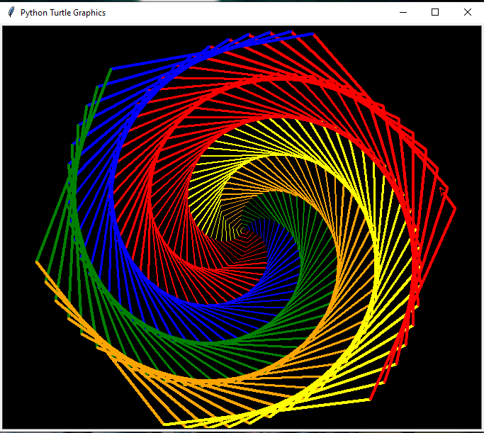

# Amazing-Pattern-using-python-turtle

# Getting to Know the Python turtle Library
### turtle is a pre-installed Python library that enables users to create pictures and shapes by providing them with a virtual canvas. The onscreen pen that you use for drawing is called the turtle and this is what gives the library its name. In short, the Python turtle library helps new programmers get a feel for what programming with Python is like in a fun and interactive way.

---

### turtle is mainly used to introduce children to the world of computers. It’s a straightforward yet versatile way to understand the concepts of Python. This makes it a great avenue for kids to take their first steps in Python programming. 

